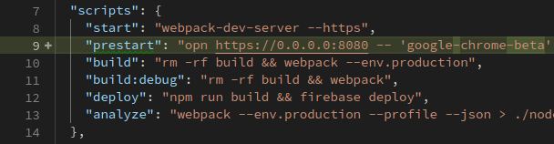

# React-pwa-guide


# Demo

[Demo](https://react-pwa-hello-world.firebaseapp.com/#/) is working on firebase hosting. Please take a look.

# Features

<details>
<summary>
Feature list
</summary>


- **Material Design and AppShell**: Responsive, fit any form factor, desktop but the first is mobile. AppShell architecture implemented wearing material design got bressed by [material-ui.com](https://material-ui.com)
- **ES6 via Babel**: You can use ES6 feature with same babel-preset to [create-react-app](https://github.com/facebookincubator/create-react-app) and dynamic module importing
- **Webpack**
  - **Remarkable configurations**: Webpack configuration file has been written in configurable, optimzied and easy settings
  - **Developing Progressive Web App**: You can check them of optimized bundling for PWA including code-splitting, multiple chunk and [preload](https://www.npmjs.com/package/preload-webpack-plugin). As developing, reloading changes instantly by webpack-dev-server, also it is working well with [service worker](https://github.com/ragingwind/sw-precache-webpack-dev-plugin)
- **HTTPS**: Deploying to Firebase Hosting to run perfectly on HTTPS with PWA features
- **Web Push**: Web Push demo also is branded at this app by Firebase Push Messaging
- **Service Worker**: Generating service worker scripts is completly intergrated in build process with Webpack 2 and plugins
- **Web Manifest**: Have a look how to installable webapp work by Web Manifest
- **Realtime Database**: We featured firebase to show PWA how to work with fetched data and cached data via service worker
- **Server Side Rendering**: Deprecated in favour of using code splitting and react-router 4 ~~Presenting intial page in short time is an important issue. This guide kit includes
simple server side code for demonstration. Buidling PWA for Server Side Rendering version landed You can take a look what is different between both of versions~~
- **React Lite Support**: To achieve minimal vundle size at initializing time of the app, we support for building with react-lite. Simple, you can get another version of app running on `react-lite` if you could add the additional argument on build command when you build `-- --env.lite`

</details>

# Getting Started

clone this repo

```sh
git clone https://github.com/ my-new-project

cd my-new-project
```

## Setup

### install dependencies
```sh
npm install

npm install -g firebase-tools
```

### setup firebase

Make a project:


during firebase init, input with following answers
  - select `hosting only`
  - select `your project` or `create one`
  - input `build` as your public directory, which is default build path
  - answer `no` for configuration as a single-page app
  - no overwrite any files in source

```sh
firebase login
firebase init
```


### setup configuration
copy into .env and update values in the file with the intialize value you get from firebase in compliance with loading env as you build
```
cp .env.example .env
```

Edit `.env` with your API keys, find them in the firebase console:


### add a database to firebase 


### Start developing!

Now you're ready to launch your app in development mode!

Start on localhost:
```sh
# starting app by webpack-dev-server
npm start
```


> *if you get an error, try changning this line in `package.json` to use `google chrome`*



:+1:


## Build when you ready for Deployment to Production

It supports three versions of build, production, development(debug) and ssr. All of build files will be in `./build`

```sh
# build in production
npm run build

# build in debug
npm run build:debug
```

### Deploy

You need to check that configuration again. You must have a project on firebase, this project have the suitable settings for firebase generated by fireblase cli and .env file must be exist with the initialize code from firebase

```sh
# make sure that run `yarn build` before you try to deploy the app to firebase
npm run deploy
```

## Firebase Cloud Messaging for Push

This guide is set up to use Push Messaging built on top of Firebase Cloud Messaging. Check out the [docs here](https://firebase.google.com/docs/cloud-messaging/)

# License

MIT
